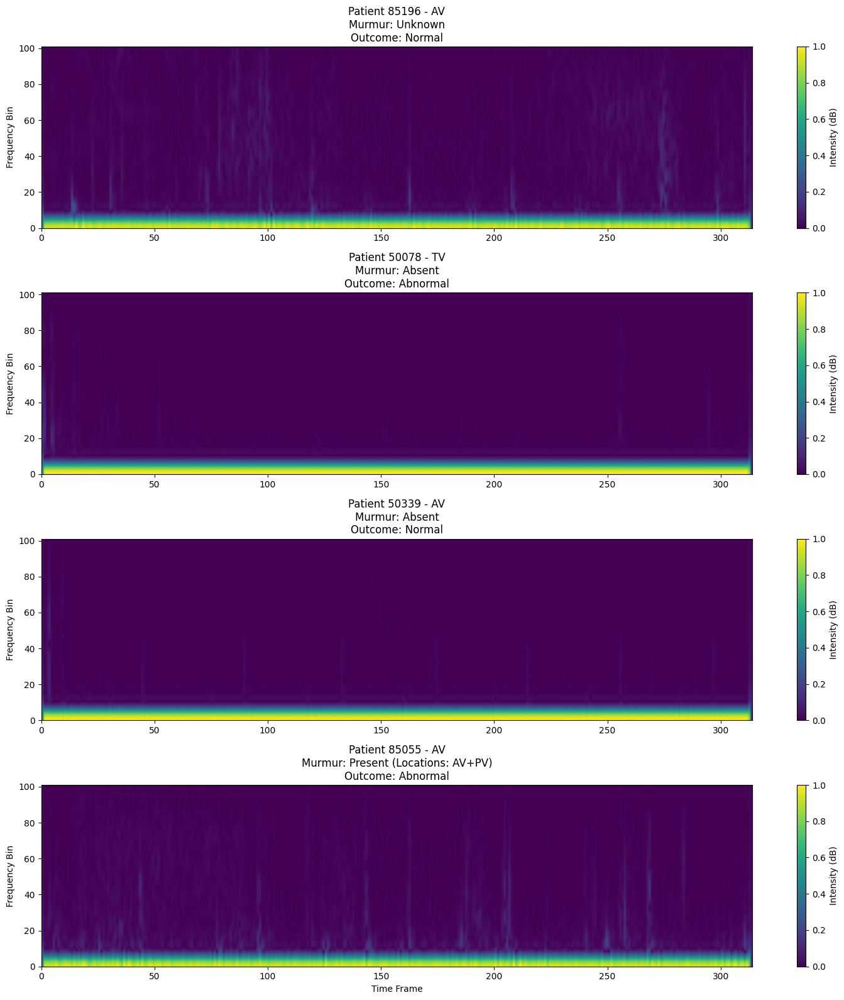
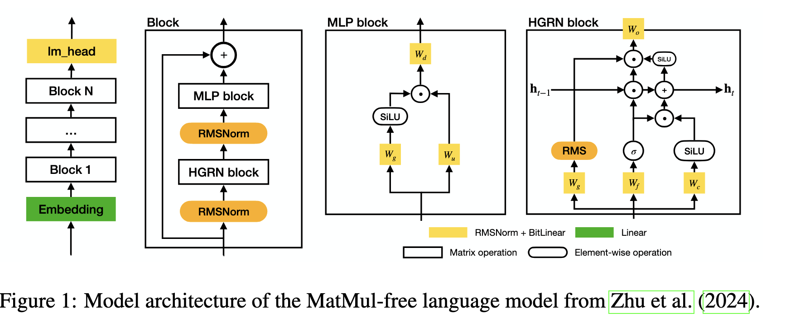

# Heart Murmur Detection via phonocardiogram

## Introduction
Heart murmurs are sounds - such as whooshing or swishing made by rapid, choppy (turbulent) blood flow through the heart. The sounds can be heard with a device called a stethoscope.

Using The CirCor DigiScope Phonocardiogram Dataset from physionet we explored two different approches to detect the two outputs - presence of a murmur and whether it is normal. While many deep neural networks can easily approximate the dependency of input on output, they are far too energy intensive and slow to be deployed on small devices. We explored the dialated convolution approach and a recently developed dense matrix multiplication free sequence classifier block suitable for this application



## Dataset
A total number of 5272 heart sound recordings were collected from the main four auscultation locations of 1568 subjects, aged between 0 and 21 years (mean ± STD = 6.1 ± 4.3 years), with a duration between 4.8 to 80.4 seconds (mean ± STD = 22.9 ± 7.4 s), totaling more than 33.5 hours of recording. Each cardiac murmur in the dataset is been annotated in detail by a human annotator, in terms of timing, shape, pitch, grading, quality and location.
### Input
There are four data file types in the dataset (per subject):

* A wave recording file (binary .wav format) per auscultation location for each subject, which contains the heart sound data
* A header file (text .hea format) describing the .wav file using the standard WFDB format [8]
* A segmentation data file (text .tsv format) per auscultation location for all subjects, which contains segmentation information regarding the start and end points of the fundamental heart sounds S1 and S2
* A subject description text file (text .txt format) per subject, where the name of the file corresponds to the subject ID. Demographic data such as weight, height, sex, age group and pregnancy status as well as a detailed description of murmur events are provided in this file.

### Output
**Murmur** :

* Present: Murmur waves were detected in at least one heart sound recording
* Absent: Murmur waves were not detected in any heart sound recording
* Unknown: The presence or absence of murmurs was unclear for the annotator

**Outcome**: The pediatric cardiologist’s overall assessment of the patient’s cardiac condition

* Normal
* Abnormal

## Approches

## Dialated Convolution
We used both the audio signal and the spectrogram of the audio signal after passing it through a butterworth filter for noise removal. This was to ensure that we capture both time dependent variation and frequency dependent variation.

The audio signal is processed through a series of dialated convolution blocks for large effective receptive field and similarly spectrogram is processed through a series of convolution layers. Extracted features are concatenated and passed though an ANN for classification.
This approach is slow and energy intensive in real time inference. Hence we move on to our second approach

## MLGRU
The MLGRU (MatMul-free Linear Gated Recurrent Unit) acts as the token mixer, replacing the
computationally expensive self-attention mechanism in traditional transformers introduced by Steven Abreu et al. The trick is to replace the expensive multiplication with accumulation by ternarizing the weights in X @ W. This is done in the bitlinear layer which is used to approximate the gate values in Gated recurrent unit. Also an MLP block which approximates the FFN block in transformers using the bitlinear layer is used. The structure of model is similar to transformers block except that it processes the data sequentially. We combined it with a selective attention block which takes care of local context.<br>

## Results

## Model Performance

| Model                   | Murmur Detection Accuracy | Outcome Detection Accuracy |
|--------------------------|---------------------------|----------------------------|
| Dilated Convolution (CNN)| 81.44%                   | 48.04%                     |
| MLGRU + Attention        | 75.59%                   | 51.02%                     |


## Folder structure
```text
.
├── CNN_model.py
├── Kernel
│   └── __init__.py
├── MLGRU_model.py
├── Models
│   ├── CNN.py
│   ├── MLGRU.py
│   ├── __init__.py
│   └── trained_model
│       └── best_model.pth
├── Preprocessing
│   ├── CNN_pre.py
│   ├── MLGRU_pre.py
│   └── __init__.py
└── common
    ├── __init__.py
    └── imports.py

```
---

### Folder Descriptions

- **`CNN_model.py`**  
  Script to train and evaluate the dilated convolutional + spectrogram fusion network (`MurmurOutcomeNet`).

- **`MLGRU_model.py`**  
  Script to train and evaluate the MLGRU + Temporal Attention Pooling model (`MurmurOutcomeMLGRU_Attn`).

- **`Kernel/`**  
  Contains custom Triton kernels for efficient low-level operations (e.g., ternary packing for BitLinear layers).

- **`Models/`**  
  Houses core model architectures: CNN-based and MLGRU-based. Includes saved models for reproducibility.

- **`Preprocessing/`**  
  Contains dataset preparation scripts tailored for each architecture:
  - Spectrogram extraction + waveform alignment for CNN.  
  - Sequence formatting for MLGRU.  

- **`common/`**  
  Shared utilities and import centralization to keep code modular and clean.


## Requirements:
Refer to ```requirements.txt```

## References
1. **CirCor DigiScope Dataset / PhysioNet Challenge 2022**:  
   Liu, C., et al. *"CirCor DigiScope Phonocardiogram Dataset."* [PhysioNet](https://physionet.org/content/circor-heart-sound/1.0.3/).  

2. **Neuromorphic Principles for Efficient Large Language Models on Intel Loihi 2**:  
   Aamir, S. A., et al. (2022). [arXiv:2207.04527](https://arxiv.org/abs/2207.04527).  

3. General murmur detection background:  
   Schmidt, S. E., et al. *"Segmentation of heart sound recordings by a duration-dependent hidden Markov model."* Physiol Meas, 2010.  


